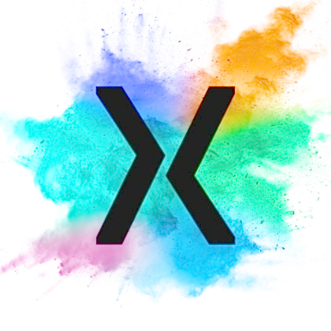

[![Contributors][contributors-shield]][contributors-url]
[![Forks][forks-shield]][forks-url]
[![Stargazers][stars-shield]][stars-url]
[![Issues][issues-shield]][issues-url]

<!-- PROJECT LOGO -->
 

  

  <h3 align="center"></h3>

  

     
    <a href="https://github.com/DeloitteDigitalUK/xLab/wiki"><strong>view handbook »</strong></a>
     
     
    <a href="https://github.com/DeloitteDigitalUK/xLab/wiki">handbook</a>
    ·
    <a href="https://github.com/DeloitteDigitalUK/xLab/releases">changelog</a>
    ·
    <a href="https://github.com/DeloitteDigitalUK/xLab/issues">make changes</a>
  

<!-- MARKDOWN LINKS & IMAGES -->
<!-- https://www.markdownguide.org/basic-syntax/#reference-style-links -->
[contributors-shield]: https://img.shields.io/github/contributors/othneildrew/Best-README-Template.svg?style=flat-square
[contributors-url]: https://github.com/DeloitteDigitalUK/xLab/graphs/contributors
[forks-shield]: https://img.shields.io/github/forks/othneildrew/Best-README-Template.svg?style=flat-square
[forks-url]: https://github.com/DeloitteDigitalUK/xLab/network/members
[stars-shield]: https://img.shields.io/github/stars/othneildrew/Best-README-Template.svg?style=flat-square
[stars-url]: https://github.com/DeloitteDigitalUK/xLab/stargazers
[issues-shield]: https://img.shields.io/github/issues/othneildrew/Best-README-Template.svg?style=flat-square
[issues-url]: https://github.com/DeloitteDigitalUK/xLab/issues
[license-shield]: https://img.shields.io/github/license/othneildrew/Best-README-Template.svg?style=flat-square
[license-url]: https://github.com/othneildrew/Best-README-Template/blob/master/LICENSE.txt
[product-screenshot]: images/screenshot.png
